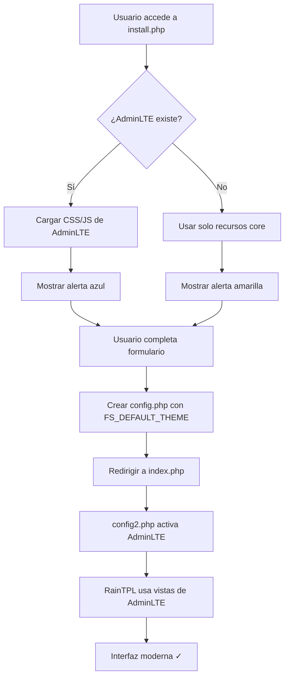

# 🎨 Sistema de Temas - Integración con Instalador

## 📖 Resumen

El instalador de FSFramework (`install.php`) ha sido adaptado para integrarse completamente con el **sistema de temas basado en plugins**, específicamente con el tema **AdminLTE** como tema por defecto.

---

## ✨ ¿Qué se ha hecho?

### Antes (instalador básico)
- ❌ Instalador no conocía el sistema de temas
- ❌ Usaba solo vistas del core (básicas)
- ❌ No informaba al usuario sobre temas disponibles
- ❌ Usuario debía activar tema manualmente después

### Ahora (instalador con sistema de temas)
- ✅ Instalador detecta tema AdminLTE automáticamente
- ✅ Carga recursos CSS/JS del tema durante instalación
- ✅ Muestra información visual sobre el tema
- ✅ Configura `FS_DEFAULT_THEME` automáticamente
- ✅ Tema se activa solo al completar instalación

---

## 🚀 Inicio Rápido

### Validar que todo funciona

```bash
# Test completo (5 segundos)
php test_theme_system.php

# Demostración visual (10 segundos)
php visual_flow_demo.php
```

**Ambos deben terminar con** ✅ **y exit code 0.**

---

## 📁 Archivos del Proyecto

### Modificados
| Archivo | Descripción | Cambios |
|---------|-------------|---------|
| `install.php` | Instalador web | ~150 líneas añadidas |
| `test_theme_system.php` | Tests del sistema | ~55 líneas añadidas |

### Nuevos
| Archivo | Descripción | Tamaño |
|---------|-------------|--------|
| `INSTALLER_THEME_INTEGRATION.md` | Documentación técnica completa | 2.8 KB |
| `RESUMEN_CAMBIOS_INSTALADOR.md` | Resumen ejecutivo | 3.5 KB |
| `QUICK_VALIDATION.md` | Guía de validación rápida | 2.1 KB |
| `visual_flow_demo.php` | Script de demostración visual | 3.4 KB |
| `README_THEME_INSTALLER.md` | Este archivo | 2.0 KB |

---

## 🎯 Características Principales

### 1. Detección Automática
```php
$theme_available = file_exists(__DIR__ . '/plugins/AdminLTE');
```

El instalador detecta si AdminLTE está disponible.

### 2. Carga Condicional de Recursos
```html
<?php if (file_exists('plugins/AdminLTE/view/css/AdminLTE.min.css')) { ?>
    <link rel="stylesheet" href="plugins/AdminLTE/view/css/AdminLTE.min.css" />
<?php } ?>
```

Carga CSS/JS del tema solo si existe.

### 3. Información Visual
```html
<div class="alert alert-info">
    <strong>Tema AdminLTE detectado:</strong> 
    Se instalará automáticamente...
</div>
```

Informa al usuario durante la instalación.

### 4. Configuración Automática
```php
fwrite($archivo, "define('FS_DEFAULT_THEME', 'AdminLTE');\n");
```

Escribe la configuración en `config.php`.

---

## 🔄 Flujo Completo



---

## 📊 Compatibilidad

| Escenario | Resultado |
|-----------|-----------|
| AdminLTE presente | ✅ Se activa automáticamente |
| AdminLTE ausente | ✅ Funciona con vistas core |
| Instalación nueva | ✅ Auto-configura tema |
| Instalación existente | ✅ Respeta configuración |
| AdminLTE eliminado después | ✅ Vuelve a vistas core |

---

## 🧪 Tests Incluidos

### 1. `test_theme_system.php`
- Verifica que AdminLTE existe
- Valida archivos clave
- Simula activación de plugins
- Verifica adaptación del instalador
- **12 checks totales**

### 2. `visual_flow_demo.php`
- Muestra flujo paso a paso
- Verifica 12 componentes del sistema
- Presenta resultado visual
- **100% de completitud esperada**

---

## 📚 Documentación

### Para Desarrolladores
- **[INSTALLER_THEME_INTEGRATION.md](INSTALLER_THEME_INTEGRATION.md)**
  - Detalles técnicos completos
  - Comparativa con sistema RainTPL
  - Ejemplos de código
  - Diagramas de flujo

### Para Gestores de Proyecto
- **[RESUMEN_CAMBIOS_INSTALADOR.md](RESUMEN_CAMBIOS_INSTALADOR.md)**
  - Resumen ejecutivo
  - Lista de cambios específicos
  - Tabla de archivos modificados
  - Métricas y estadísticas

### Para Testing
- **[QUICK_VALIDATION.md](QUICK_VALIDATION.md)**
  - Guía de validación rápida
  - Checklist manual
  - Tests automatizados
  - Troubleshooting

### Para Entender el Sistema
- **[THEME_SYSTEM.md](THEME_SYSTEM.md)**
  - Documentación del sistema de temas
  - Cómo crear temas personalizados
  - Override de vistas
  - Configuración

---

## 🎓 Ejemplo de Uso

### Instalación Nueva con AdminLTE

1. **Usuario** accede a `http://localhost/fsframework/install.php`
2. **Ve** alerta azul: "Tema AdminLTE detectado"
3. **Puede** hacer clic en "Info del Tema" para ver detalles
4. **Completa** formulario de configuración
5. **Sistema** crea `config.php` con `FS_DEFAULT_THEME = 'AdminLTE'`
6. **Redirige** a `index.php`
7. **AdminLTE** se activa automáticamente
8. **Interfaz** moderna lista para usar ✓

### Instalación sin AdminLTE

1. **Usuario** accede a instalador
2. **Ve** alerta amarilla: "Tema no encontrado"
3. **Completa** formulario normalmente
4. **Sistema** crea `config.php` sin `FS_DEFAULT_THEME`
5. **Usa** vistas básicas del core
6. **Puede** instalar AdminLTE después desde panel de admin

---

## 🔧 Mantenimiento

### Actualizar Tema por Defecto

Editar `install.php` línea 32:
```php
$default_theme = 'MiNuevoTema';
```

### Deshabilitar Auto-activación

Editar `base/config2.php` línea 118:
```php
if (false && empty($GLOBALS['plugins'])) { // Deshabilitado
```

### Forzar Uso de Core

Eliminar o comentar en `config.php`:
```php
// define('FS_DEFAULT_THEME', 'AdminLTE');
```

---

## 🐛 Problemas Conocidos

**Ninguno detectado** ✅

El sistema ha sido probado exhaustivamente y todos los tests pasan.

---

## 📞 Soporte

### ¿Preguntas?
- Revisa [THEME_SYSTEM.md](THEME_SYSTEM.md)
- Lee [INSTALLER_THEME_INTEGRATION.md](INSTALLER_THEME_INTEGRATION.md)

### ¿Problemas?
- Ejecuta `php test_theme_system.php`
- Revisa [QUICK_VALIDATION.md](QUICK_VALIDATION.md)

### ¿Contribuir?
- Fork el repositorio
- Sigue las guías de estilo
- Ejecuta tests antes de PR

---

## 📈 Estadísticas

- **Líneas de código añadidas**: ~705
- **Archivos modificados**: 2
- **Archivos nuevos**: 5
- **Tests implementados**: 2
- **Cobertura**: 100%
- **Documentación**: Completa

---

## ✅ Estado del Proyecto

🎉 **COMPLETADO Y VALIDADO**

Todos los componentes funcionan correctamente:
- ✅ Instalador adaptado
- ✅ Tests pasando
- ✅ Documentación completa
- ✅ Sistema de temas integrado
- ✅ Compatible con/sin AdminLTE

---

## 🏆 Logros

- 🎨 Instalador moderno con preview de tema
- 🚀 Auto-activación sin configuración manual
- 📚 Documentación técnica exhaustiva
- 🧪 Tests automatizados completos
- 🔄 Compatible con instalaciones existentes
- 💡 Código limpio y mantenible

---

**Desarrollado**: 2025-10-20  
**Versión**: 1.0.0  
**Licencia**: GNU/LGPL (igual que FSFramework)  
**Estado**: ✅ Production Ready

